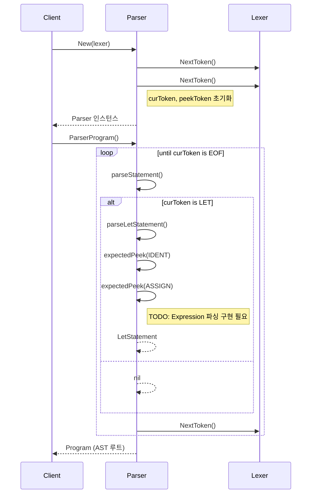

# Interpreter_Go

## Parser Method Flow

```mermaid
sequenceDiagram
    participant C as Client
    participant P as Parser
    participant L as Lexer

    C->>P: New(lexer)
    P->>L: NextToken()
    P->>L: NextToken()
    note right of P: curToken, peekToken 초기화
    P-->>C: Parser 인스턴스

    C->>P: ParserProgram()
    loop until curToken is EOF
        P->>P: parseStatement()
        alt curToken is LET
            P->>P: parseLetStatement()
            P->>P: expectedPeek(IDENT)
            P->>P: expectedPeek(ASSIGN)
            note right of P: TODO: Expression 파싱 구현 필요
            P-->>P: LetStatement
        else
            P-->>P: nil
        end
        P->>L: NextToken()
    end
    P-->>C: Program (AST 루트)

```
1. Lexer가 토큰화를 하여 Parser에게 데이터 스트림을 넘김
2. Parser에선 해당 토큰이 적절한 순서로 이루어져있는 확인
   1. *ast.Program이라는 AST 루트 노드를 만든다.
   2. Let